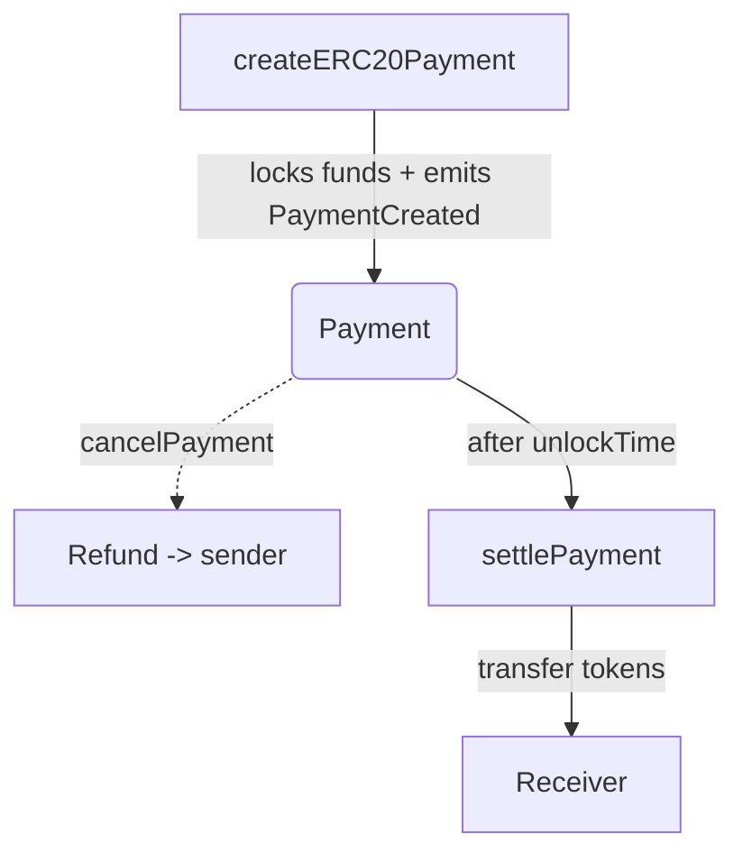

# Paymatic Smart Contract

 

A trust‑minimized **ERC‑20 escrow / payment‑link protocol** that protects users from address‑poisoning and other mis‑delivery attacks. Funds are locked in a smart contract with a configurable *grace period* so the sender can verify the destination **before** the receiver is able to withdraw.

> **Mainnet:** <https://paymatic.xyz> • **Testnet (dev):** <https://dev.paymatic.xyz>

---

## ✨ Key Features

| Feature | Description |
|---|---|
| **ERC‑20 escrow** | Supports any ERC‑20 token by passing the token address. |
| **Grace period** | Default `DEFAULT_TIMELOCK = 120 s` (2 minutes). Custom timelock via `createERC20PaymentWithTimeLock`. |
| **Cancelable** | Sender can cancel any time until the receiver withdraws; owner can *emergency cancel*. |
| **Protocol fee** | Default **0.3 %** (300 ppm). Configurable by owner through `setFeeValue()`. Fees auto‑sent to `feeRecipient`. |
| **Pausable** | Owner can pause/unpause all state‑changing actions. |
| **Events‑first design** | All state changes emit events for easy off‑chain indexing & link generation. |

---

## 📜 How It Works



1. **createERC20Payment / createERC20PaymentWithTimeLock** – Sender deposits tokens & sets `receiver`, `token`, `amount`, and optional `timelockPeriod`.
2. Contract emits `EventPaymentStatusChangeCreated` containing `paymentId` → build off‑chain link `https://paymatic.xyz/receive/<paymentId>`.
3. During grace period the sender may call **cancelPayment**; owner may call **emergencyCancelPayment**.
4. After `unlockTime`, the receiver calls **settlePayment** to withdraw.

---

## 🏗️ Project Structure

```
contracts/                  👉 Solidity sources
  └─ PaymaticPayments.sol   👉 Core escrow contract
ignition/                   👉 Hardhat deployment scripts
test/                       👉 Hardhat tests
```

---

## 🚀 Quick Start

### Prerequisites

* Node.js ≥ 22
* yarn 
* Hardhat 

### Install & Compile

```bash
# clone repo
$ git clone https://github.com/crypto-paymatic/contracts.git
$ cd contracts

# install deps
$ yarn 

# compile
$ yarn build
```

### Run Tests

```bash
# hardhat + chai
$ yarn test

# coverage
$ yarn coverage
```

### Deploy to Testnet

```bash
# set RPC and PRIVATE_KEY in .env
$ npx hardhat ignition deploy ignition/modules/PaymaticPayments.ts --network sepolia
```

---

## 🔌 Contract Addresses (production)

Paymatic deployed on all chains using create2 strategy, meaning it has the same address everywhere

`0x7A1Bae8b00250324D809e7Ca04dACBbBb2683c87`

---

## 📝 Solidity API Reference (`PaymaticPayments.sol`)

### Structs & Enums

| Name | Fields |
|---|---|
| `PaymentStatus` | `Default`, `Created`, `Settled`, `Canceled` |
| `Payment` | `id`, `from`, `to`, `token`, `amount`, `status`, `unlockTime` |

### Public / External Functions

| Function | Access | Description |
|---|---|---|
| `createERC20Payment(address to, address token, uint256 amount)` | External | Locks tokens using default timelock. |
| `createERC20PaymentWithTimeLock(address to, address token, uint256 amount, uint256 timelock)` | External | Same as above but custom `timelock`. |
| `cancelPayment(uint256 id)` | External | Sender only, if status == Created. |
| `settlePayment(uint256 id)` | External | Receiver only, post‑unlock. |
| `getPaymentDetails(uint256 id)` | View | Returns `Payment` struct. |
| `getFeeValue()` / `getFeeRecipient()` | View | Protocol‑level settings. |
| `pause()` / `unPause()` | Owner | Pauses/unpauses contract. |
| `setFeeRecipient(address)` / `setFeeValue(uint256)` | Owner | Updates protocol fee settings. |
| `emergencyCancelPayment(uint256 id)` | Owner | Refunds sender in emergencies. |

### Events

| Event | Trigger |
|---|---|
| `EventPaymentStatusChangeCreated(id, from, to, token, amount, unlockTime)` | On payment creation. |
| `EventPaymentStatusChangeSettled(id)` | On successful withdrawal. |
| `EventPaymentStatusChangeCanceled(id)` | When sender cancels. |
| `EventPaymentStatusChangeCanceledEmergency(id)` | When owner emergency‑cancels. |
| `FeeRecipientChanged(newRecipient)` | Owner updates fee recipient. |
| `FeeValueChanged(newValue)` | Owner updates fee rate. |

### Custom Errors

`PaymentNotFound`, `AmountShouldBeGreaterThanZero`, `InvalidAddress`, `PaymentShouldBeInCreatedState`, `PaymentTimelocked`, `NotPaymentSender`, `NotPaymentRecipient`, `NotEnoughProtocolFees`, `ProtocolFeeDistributionError`, `NotEnoughTokenBalance`, `NotEnoughTokenAllowance`.

---

## 💸 Protocol Fee Calculation

`feeAmount = amount × feeValue ÷ 100 000`

* **Default feeValue:** `300` → **0.3 %** (300 ppm)
* Collected fees are `SafeERC20.safeTransfer`‑ed to `feeRecipient` immediately upon deposit.

---

## 🔒 Security Considerations

* **Reentrancy‑safe** by leveraging OpenZeppelin’s `SafeERC20` (no external calls after state mutation).
* `Pausable` circuit‑breaker controlled by owner.
* Emergency cancel allows rapid sender refunds if an exploit is discovered.
* Extensive unit + fuzz tests (see `/test`).
* Pending 3rd‑party audit — see `SECURITY.md`.

If you discover a vulnerability, please follow the disclosure guidelines in **SECURITY.md**.

---

## 🤝 Contributing

Pull requests are welcome! Please open an issue first to discuss substantial changes.

```bash
# lint & format
$ yarn lint
$ yarn format
```

See **CONTRIBUTING.md** for coding standards and branch workflow.

---

## 📜 License

Distributed under the **Business Source License 1.0 (BSL‑1.0)**. See `LICENSE` for details and change date.

---

## 📮 Contact & Community

* Twitter/X: [@paymatic](https://twitter.com/paymatic)
* Email: i@axot.io

> *Built with ❤️ by the Paymatic core team & our community.*

---

## 🙏 Acknowledgements

* [OpenZeppelin](https://openzeppelin.com/) for battle‑tested libraries.
* [Hardhat](https://hardhat.org/) for better development tooling.
* All early Paymatic users providing feedback and testing.

---

> **Disclaimer:** Contracts are provided *as‑is*. Use in production only after independent audits.


